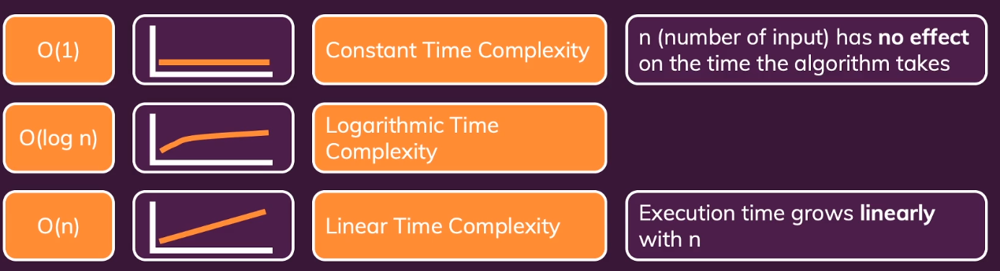
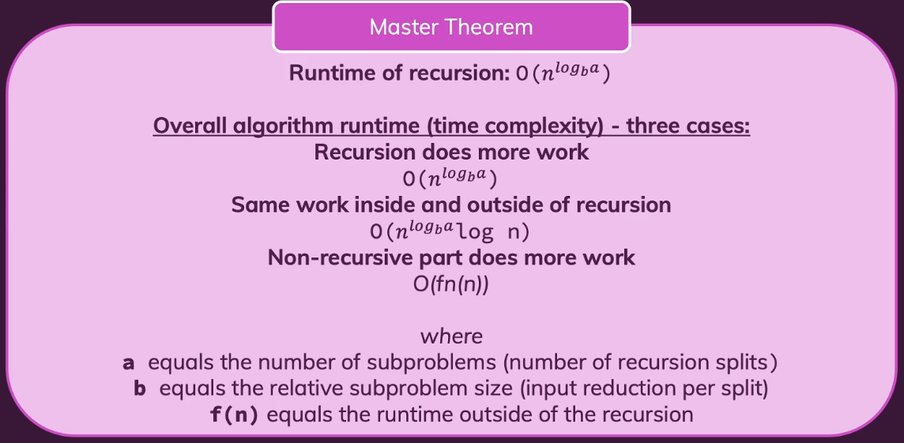

# Big O Notation
When dealing with problems that you don't understand, or can't quantify what's average or worst, you can simply think of the average as the same as the worst, in fact, most algorithms have the same average case as the worst case.

We need to have an idea of the behavior, not the absolute concept of it, like, is the algorithm linear, cuadratic, constant or logaritmic functions.

Looking for patterns is better than deriving the absolute cases of everything.

# How to solve problems
First, check what's the input and verify the problem.

Derive a verbal solution about it, it's still about thinking loudly.

Just talking about it helps you come up with a better solution.

Write down a first version (e.g. in pseudo-code).

Then you derive the time complexity and see if you can improve the solution later.

Practice makes perfect, of course!

## Simplify problems.
Split the problems into smaller problems, e.g.split arrays into chunks, and *possibly* combine it with recursion.

## Debug code.
Use the console log or break points to verify what's in your (temporary) variables; This is absolutely fine, also in interviews!

## Helper variables.
Use helper arrays to store immediate results.

# Space Complexity
As much as time complexity is an issue, space complexity is something you should not forget when working with embedded device as the specs are fairly weak compared to the PC version, and have a very limited amount of memory to work with.

To make matters short, most of the time, factorial functions will have a higher space complexity than their loop based counter'part.

# Recursivity
There's some type of operations that are easier to understand with recursivity.

To make a recursive function, you need to base it on a base case, and normal logic.

The normal logic will be done everytime the base case is not achieved, the base case can be thought of what to do, if the task is considered to be complete.

Usually recursivity isn't a good practice, as it has to deal with quite an overhead, like allocating memory on the Stack.

# Sets
A set is a collection of values which forms an entity itself, that, is basically translated to an *Array* full of unique values, they can't repeat themselves.

In most contexts, an array is a set, with some exceptions of course.

## Dynamic programming
Recursivity can be made easier with *memoization*, it just means to keep some data around between every process.

Sometimes *memoization* it can lead to work duplications.

# Search algorithms
Search algorithms is how to find something in the most efficient way.
There's two types of search algorithms, those being:
- Linear Search.
  Looks through the elements one by one. (Works on unordered and unordered lists).
- Binary Search.
  Looks through the elements by dividing it in two. (Only works on onrdered lists).

# Sorting
Is having an array full of data that isn't sorted, then, efficiently get a new array with the elements in order. Either ascending or descending.

## Algorithms

### Bubble sort
Bubble sort goes through the elements almost twice, it starts with an outer element and then cicle every other element inside, until, it gets to the end of the inner loop and then continues with the outer.

This is better explained or seen through code.

With a quadratic complexity this might not be the best solution.

### Quick sort
This function uses recursion to sort elements.

We start by getting a *pivot* element, and comparing the other elements inside it.

The exit case is getting an empty array.

There are 3 cases for the *pivot* element, whether the element is:
- Larger
- Equal
- Smaller

Then, we use **recursion**, by sending the Larger, Equal and Smaller list of elements into *quicksort* again.

At the end we concatenate the elements, so that we end up with the same list again.

This algorithm ironically has a bigger runtime when it's sorted than when it isn't, it has gains over BubbleSort in most instances.

### Merge sort
Merge sorts grabs a list, and tries to divide the list in 2, by getting the element in the middle.

The exit case of the Merge Sort is whether the list is empty or has only one element it should return itself, or if there's only 2 elements inside, in which case a ternary expression is more than enough to sort it.

First, merge sort slices the list in two by the *floored* middle, then, it uses **recursion** with those two lists, and gets a sorted version back.

Then, with those two sorted lisits, it goes through a loop exhausting the two lists, comparing by each step if the left element is bigger than the right element and pushing into the list the smaller, until it exhausts both of them.

*As always, this is better explained in code*.

## Master theorem

# On an interview
More than likely you're not going to know the best solution at heart, because there's stuff like Math involved in whatever you want to do.

The interviewer may just point you to some math you can use for it, and in a real, big project, Google exists.

You should think aloud, not in your mind, don't go straight into coding.